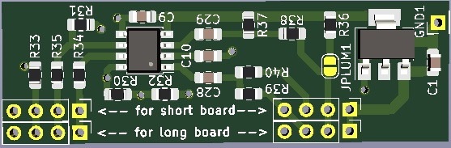

# C64 Video Enhancement, Analog Only

The analog circuit that was just meant as a simple replacement to take over
the function of the RF modulator to keep the A/V port somehow functional,
seems to be remarkably good in its own right.
So for users that just want a cheap solution to improve the original
video signals (luma,chroma,composite), this board may be a viable option.

	