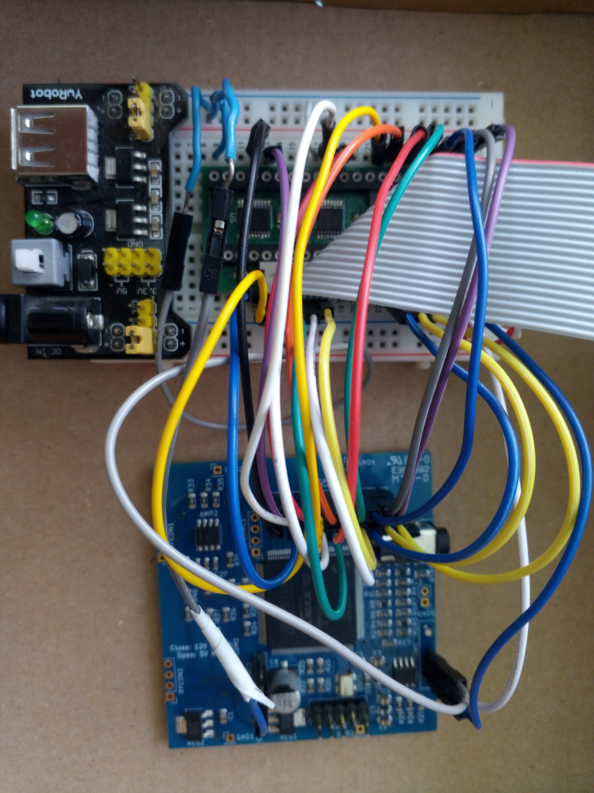

# Test device for the C64 video enhancement mod

In case of a series production of the mod, you probably need some means
to test the mod boards without actually installing them into a real C64.
For this purpose, the necessary input signals can be generated by a 
second FPGA board, programmed to simulate the various VIC signals.
These are fed into the VIC adapter board (via a ZIF socket for example)
which will in turn drive the FPGA board under test to generate the test image.

The provided firmware (TestSignalGenerator.pof) will turn a standard 
C64 video enhanchement board  into a signal generator that uses the GPIO1 port 
and two additional pins as outputs instead of inputs.
Be careful to use such a board only for this test purpose, as
it will cause damage to connect some other signal source to these outputs.

	

## Wiring the power 

| Power input  | Signal generator | VIC adapter | VIC-IIe adapter |
| ------------ | ---------------- | ----------- | --------------- |
| +5V          | RFCONC2 1        | Pin 40      | Pin 48          |
| GND          | SW1 3            | Pin 20      | Pin 24          |

## Wiring up the signal generator outputs to the VIC adapter

| FPGA pin | Signal generator | VIC adapter  | VIC-IIe adapter | Signal      |
| -------- | ---------------- | ------------ | --------------- | ----------- |
| 74       | GPIO1 1          | Pin 1        | Pin 1           | DB6         |
| 76       | GPIO1 3          | Pin 2        | Pin 2           | DB5         |
| 78       | GPIO1 5          | Pin 3        | Pin 3           | DB4         |
| 80       | GPIO1 7          | Pin 4        | Pin 4           | DB3         |
| 87       | GPIO1 9          | Pin 5        | Pin 5           | DB2         |
| 91       | GPIO1 11         | Pin 6        | Pin 6           | DB1         |
| 97       | GPIO1 13         | Pin 7        | Pin 7           | DB0         |
| 99       | GPIO1 15         | Pin 10       | Pin 13          | CS          |
| 101      | GPIO1 17         | Pin 11       | Pin 14          | RW          |
| -        | GND              | Pin 12       | Pin 10          | BA (unused) |
| 105      | GPIO1 19         | Pin 16       | Pin 12          | AEC         |
| 106      | GPIO1 20         | Pin 17       | Pin 18          | PHI0/1MHz   |
| 103      | GPIO1 18         | Pin 24       | Pin 32          | A0          |
| 100      | GPIO1 16         | Pin 25       | Pin 33          | A1          |
| 98       | GPIO1 14         | Pin 26       | Pin 34          | A2          |
| 92       | GPIO1 12         | Pin 27       | Pin 35          | A3          |
| 88       | GPIO1 10         | Pin 28       | Pin 36          | A4          |
| 81       | GPIO1 8          | Pin 29       | Pin 37          | A5          |
| 79       | GPIO1 6          | Pin 35       | Pin 43          | DB11        |
| 77       | GPIO1 4          | Pin 36       | Pin 44          | DB10        |
| 75       | GPIO1 2          | Pin 37       | Pin 45          | DB9         |
| 39       | SW1 1            | Pin 38       | Pin 46          | DB8         |
| 40       | SW1 2            | Pin 39       | Pin 47          | DB7         |

_(Most of the pins on both adapters are in the same location relative to pin 1, only the five pins 10-18 are in different locations)_
